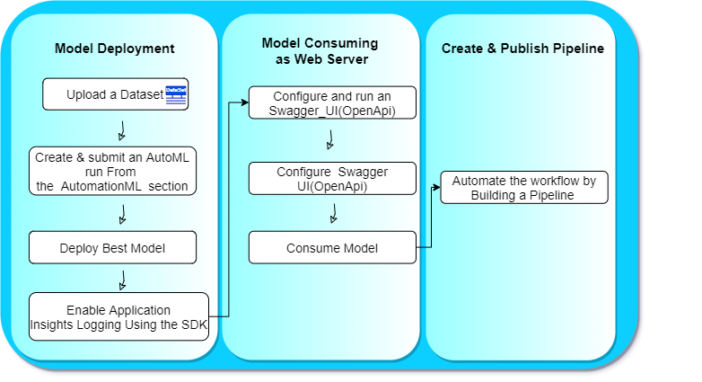

*NOTE:* This file is a template that you can use to create the README for your project. The *TODO* comments below will highlight the information you should be sure to include.

# Operationalizing Machine Learning Model

## Overview 

This project is part of the Udacity Azure ML Nanodegree. In this project, we Deploy a Model, configure logging and consume its endpoint by providing an URI and a key using consume tab under Model pane within the endpoint section on Azure ML. This model is then compared to an Azure ML SDK implementation of the same steps.

## Architectural Diagram
*TODO*: Provide an architectual diagram of the project and give an introduction of each step. An architectural diagram is an image that helps visualize the flow of operations from start to finish. In this case, it has to be related to the completed project, with its various stages that are critical to the overall flow. For example, one stage for managing models could be "using Automated ML to determine the best model". 

## Key Steps
   1- Upload the dataset to use within the experiment:
   
   
   
### Deploy model in Azure ML Studio

   2- Create and run an AutoML run from the Azure AutomationML section and once it's completed, select the best model and deploy it via the Deploy button:
   
   
   
   
   
   
   
   #Add finished Deployment screenshot
   
   4- Visit the Azure endpoint section to explore the endpoint created
   
   #Add the created endpoint screenshot
   
   5- Enable "Application Insights" using Python Azure SDK and run it to see the logs:
   
   
  
   
   
### Publish an ML Pipeline

## Screen Recording
*TODO* Provide a link to a screen recording of the project in action. Remember that the screencast should demonstrate:

## A short description of how to improve the project in the future

## Standout Suggestions
*TODO (Optional):* This is where you can provide information about any standout suggestions that you have attempted.
