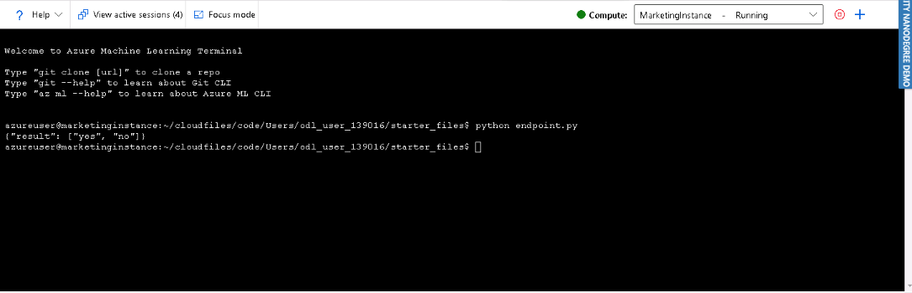

# Operationalizing Machine Learning Model

## Overview 

This project is part of the Udacity Azure ML Nanodegree. It aims to Deploy a Model, configure logging and consume its endpoint by providing a URI and a key using consume tab under the Model pane within the endpoint section on Azure ML. This model is then compared to an Azure ML SDK implementation of the same steps.

## Architectural Diagram

## Key Steps
   1- Upload the dataset to use within the experiment:
   
   
   
#### 2- Deploy model in Azure ML Studio

   **- Submit and complete an AutoML run from the Azure AutomationML section:**
   
   
   
   
   
   
   
   
   
   **- Deploy the best model and enable "Application Insights"** using Python Azure SDK and the logs.py script, and verify it via the _endpoints_ section:
   
   
   
   
   
   #### 4- Swagger Documentation:
   
   **- Activate Swagger by running _swagger.sh_ script**: Because we don't have perimissions to use the port _80_ we need to choose another above the _8000_ port, in my case it's _9001_:
   
   
   
   
   **- Create an HTTP server** to expose the current working directory via the _serve.py_ script:
   
       
   
   
   
   **- Visit the Swagger UI** and use the http://localhost:8000/swagger.json to explore the endpoint created earlier:
   
   
   
   #### 5- Consume Model Endpoints:
   
   **- Using endpoint.py script**: First, change the Scoring Uri and the key by the ones provided within the _Details_ and _Consume_ tabs from the _Endpoints_ section, then test it, the result will be:
   
   
   
   **- Using benchmark.sh script**: As explained above, after changing the Uri and the key, run the benchmark.sh to visualize the HTTP requests from the created endpoint: 
   
   
   
   
   
   
   
   
   #### 6- Create, Publish and Consume a Pipeline:
   
   
   
### Publish an ML Pipeline

## Screen Recording
*TODO* Provide a link to a screen recording of the project in action. Remember that the screencast should demonstrate:

## A short description of how to improve the project in the future

1 - Consider giving more time for training the model since we were rrestricted to one hour within this project.

## Standout Suggestions
*TODO (Optional):* This is where you can provide information about any standout suggestions that you have attempted.
