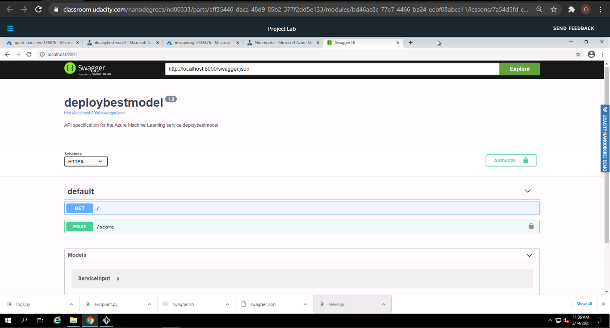
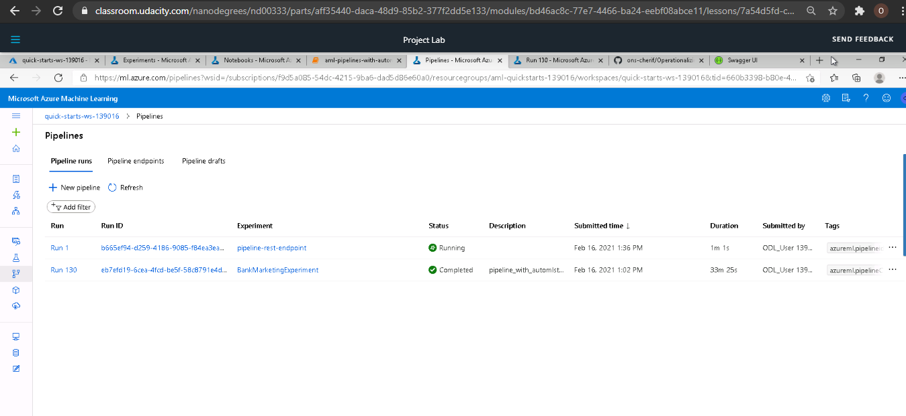

# Operationalizing Machine Learning Model

## Overview 

This project is part of the Udacity Azure ML Nanodegree. It aims to Deploy a Model, configure logging by enablibg "Application Insights" and consume its endpoint by the provided URI and a key from the endpoint details page. Then using the same created Experiment, same cluster and the same already uploaded dataset we created and published a pipeline REST endpoint using the Azure ML SDK within Jupyter.

## Architectural Diagram

## Key Steps

### Authentication: Create a Service Principle is not allowed within the Udacity VM account, so I skipped it.

### Automated ML Experiment

#### 1- Upload the dataset to use within the experiment:
   
   
### Deploy the Best Model: 

#### 2- Deploy model in Azure ML Studio

   **- Submit and complete an AutoML run from the Azure AutomationML section:**
   
   
   
   
   
   
   
   
   
   **- Select the best model, enable  authentication and deploy it using Azure Container Instance (ACI), then enable "Application Insights"** using Python Azure SDK and the logs.py script.Finally, verify the endpoint details from the _endpoints_ section:
   
   
   
   
   
#### 3- Swagger Documentation:
   
   **- Activate Swagger by running _swagger.sh_ script**: Because we don't have perimissions to use the port _80_ we need to choose another above the _8000_ port, in my case it's _9001_:
   
   
   
   **- Create an HTTP server** to expose the current working directory via the _serve.py_ script:
   
   
   
   **- Visit the Swagger UI** and use the http://localhost:8000/swagger.json to explore the endpoint created earlier:
   
   
   
   #### 4- Consume Model Endpoints:
   
   **- Using endpoint.py script**: First, change the Scoring Uri and the key by the ones provided within the _Details_ and _Consume_ tabs from the _Endpoints_ section, then test it, the result will be:
   
   
   
   **- Using benchmark.sh script**: As explained above, after changing the Uri and the key, run the benchmark.sh to visualize the HTTP requests from the created endpoint: 
   
   
   
   
   
   
   
   ### Publish an ML Pipeline
   
   #### 5- Create, Publish and Consume a Pipeline:
   
   Using the same Experiment, model and cluster, I created and published a pipeline via Jupyter Notebook:
   
   **- Created pipeline:** 
   
   
   
   **- Pipeline endpoint:** 
   
   
   
   **- Bankmarketing dataset with the AutoML module:** 
   
   
   
   
   
   
   **- The “Published Pipeline overview”, showing a REST endpoint and a status of ACTIVE:**
   
   
   
   **- Showing the step runs using _RunDetails Widget_ via _Jupyter Notebok_ :**
   
   
   
   
      
   **- Showing the scheduled run via ML Studio portal :**
   
   
   
   

## Screen Recording

  This is the link to my screencast: https://youtu.be/N6rPYo678e0

## Future Improvments:

1 - Consider giving more time for training the model since we were restricted to one hour within this project, to go through all possible model combinations and comapare it with this experiment to highlight the changes if there are any.

2 - Enhancing the dataset and deal with the problems of the imbalaced data encountered within project one since we are using the same Bank Marketing dataset.

3 - This endpoint is only for learning puposes but I want to make more enhancments like: 
     -  Using the scaling feature of Azure based on demand 
     - Add more methods to swagger and enable swagger testing directly from the UI.
