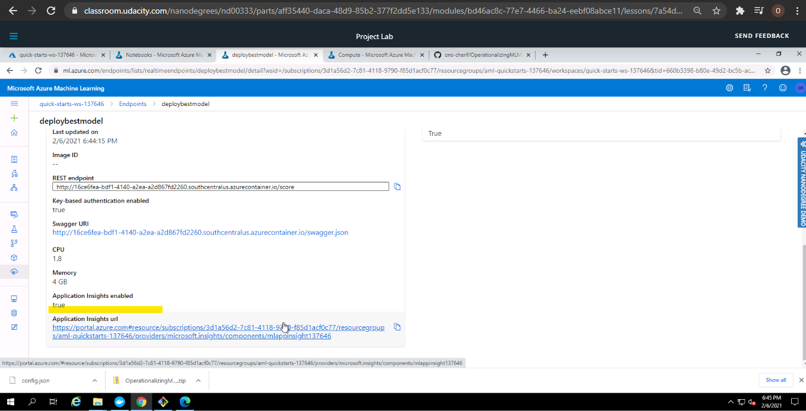

# Operationalizing Machine Learning Model

## Overview 

This project is part of the Udacity Azure ML Nanodegree. It aims to Deploy a Model, configure logging and consume its endpoint by providing a URI and a key using consume tab under the Model pane within the endpoint section on Azure ML. This model is then compared to an Azure ML SDK implementation of the same steps.

## Architectural Diagram

## Key Steps
   1- Upload the dataset to use within the experiment:
   
   
   
### Deploy model in Azure ML Studio

   2- Submit and complete an AutoML run from the Azure AutomationML section, then deploy the best model and deploy it via the Deploy button:
   
   
   
   
   
   
   
   
   
   
   #Add finished Deployment screenshot
   
   4- Visit the Azure endpoint section to explore the endpoint created
   
   #Add the created endpoint screenshot
   
   5- Enable "Application Insights" using Python Azure SDK and run it to see the logs:
   
   
  
   
   
### Publish an ML Pipeline

## Screen Recording
*TODO* Provide a link to a screen recording of the project in action. Remember that the screencast should demonstrate:

## A short description of how to improve the project in the future

1 - Consider giving more time for training the model since we were rrestricted to one hour within this project.

## Standout Suggestions
*TODO (Optional):* This is where you can provide information about any standout suggestions that you have attempted.
